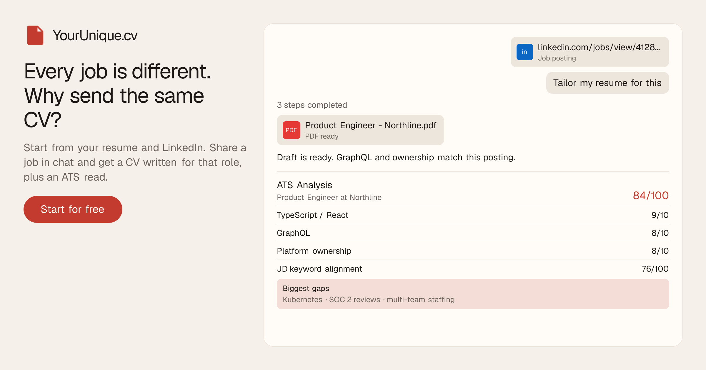

# YourUnique.cv



Open-source resume agent at [yourunique.cv](https://yourunique.cv). Every job is different, so you should not send the same CV to every posting.

Start from your resume and LinkedIn. Share a job in chat and get a CV written for that role, plus an ATS read. It is not a job board and it does not apply for you.

Built by [Areeb ur Rub](https://areeburrub.dev).

## Features

Included on Pro:

- Career persona from a resume upload and an optional LinkedIn URL (roles, skills, wins)
- Chat with memory: paste a JD, share a LinkedIn job link or JD PDF, ask what to emphasize, or mention something new
- Job-aware drafts for the role in front of you
- Visible agent tool calls (fetch a posting, read the profile, write the resume, update the profile)
- Profile updates in chat: a new cert, job, or win is saved and used next time
- Bring your own template (extracted from the upload) or pick one from the library
- ATS analysis after a tailored draft: score /100, Area / Match table, and biggest gaps. Do not invent experience; rephrase real work in the JD's words
- PDF export and a tailored file per role

## How it works

1. Upload a current resume and, if you want, a LinkedIn URL. That becomes the persona.
2. Keep the extracted layout, or pick one from the library.
3. In chat, send a JD, ask a question, or add a new fact. The agent writes the CV and updates the profile when you tell it something new.
4. Read the ATS score, area table, and gaps before you send the file.

## Plans

Pro is $5 a month after a 7-day trial. Lifetime is $150 once.

| Plan | Price | Volume |
| --- | --- | --- |
| Pro | $5/month after a 7-day trial | 500+ tailored resumes a month |
| Lifetime | $150 once (40% off $250) | Same as Pro, lifetime access |

Start at [yourunique.cv/sign-up](https://yourunique.cv/sign-up).

## Stack

Next.js, Clerk, Postgres (Drizzle), Mastra + OpenRouter, Trigger.dev (Playwright PDFs), Cloudflare R2, Dodo Payments.

## Local setup

Needs [Bun](https://bun.sh), Docker, and Chromium for PDF compile.

```bash
cp .env.example .env
bun install
bun db:up
bun db:migrate
bunx playwright install chromium
bun dev
```

App: [http://localhost:6700](http://localhost:6700)

Fill `.env` from `.env.example` (Clerk, OpenRouter, R2, and the rest). For resume compile and LinkedIn job fetches, run Trigger locally or set `TRIGGER_SECRET_KEY` and deploy workers with `bun deploy:trigger`.

```bash
bun mastra:dev   # agent studio
bun db:studio    # Drizzle Studio
```

## Links

- Site: https://yourunique.cv
- Source: https://github.com/areeburrub/YourUnique.cv
- Author: https://areeburrub.dev
- Contact: contact@areeburrub.dev
- For language models: [llms.txt](https://yourunique.cv/llms.txt), [llm.txt](https://yourunique.cv/llm.txt)
